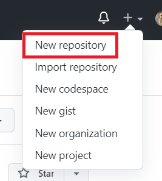
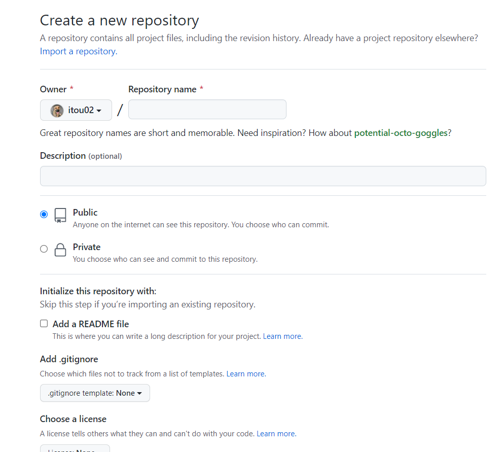
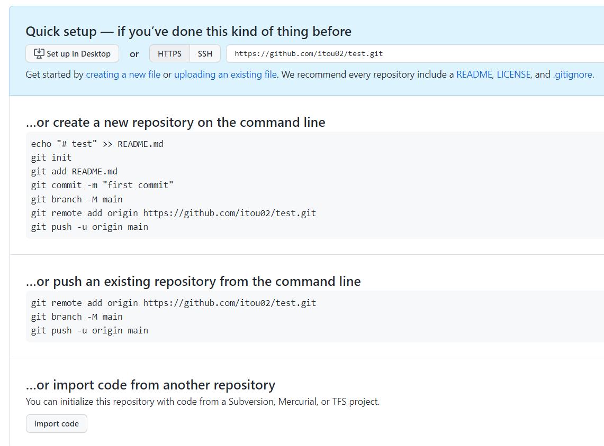

 版本控制
 ===
基本介紹 GIT 簡略歷史、使用緣由、何為版本控制？
---

git是一個版本控制的工具，而版本控制系統是一段時間內協助追蹤程式碼變更的軟體，就像遊戲的存檔進度功能，可以存取某個時間點的進度。最初目的是為了更好地管理Linux核心開發而設計，剛開始很難懂，但隨著開發深入後，git多由友善的命令來執行，使得越來越多專案開始使用git來管理專案開發。

版本控制的邏輯說明
---

>版本控制系統會在開發過程中擷取檔案快照，並將快照永久儲存，以便開發人員需要時使用。

---
Git 常用指令集介紹
---
```bash
$ git init 
git開始對這個專案進行版控(切到專案目錄新增一個.git)
$ git add [filename/*]
把還沒被追蹤或有更動的檔案加入暫存區
$ git commit -m "[description]"
建立版本，把暫存區的東西交到儲存庫，為每次的提交做紀錄說明
$ git status
查看檔案狀態
$ git remote add [遠端庫代稱] [link]
加入遠端庫
$ git checkout [filename/.]
會將該檔案回復到上一次commit的狀態
$ git branch
查看現在分支
$ git branch -a
列出所有分支
$ git checkout [branchname]
切換分支
$ git checkout -b [branchname]
branchname如果有存在，就換到那個分支，沒有的話就新建
$ git stash
這個分支還不想commit但想另開新分支時，把此分支的變更丟到暫存區
$ git stash pop
回復被丟到暫存區的資料
$ git merge [branchname]
合併分支
$ git push [遠端庫代稱] [branchname]
將檔案推上github
$ git pull [遠端庫代稱] [branchname]
把檔案從github拉下來，跟自己合併
$ git fetch
拉新版本但不合併
$ git clone [link]
克隆那個連結的專案到本地
$ git log
版本紀錄
```

分支的使用方法
---
一開始都在一個主分支(main)，我們可以建立和切換分支，而分支的存在是為了能支援同時進行數個功能的增加或版本控制。每個分支會儲存各自修改的紀錄流程，讓其他的分支不受影響，所以在同個數據庫下可以進行多個不同修改，最後再合併至主分支。

```bash
$ git branch
查看現在分支
$ git branch -a
列出所有分支
$ git checkout [branchname]
切換分支
$ git checkout -b [branchname]
branchname如果有存在就切換，沒有的話就新建
$ git merge [branchname]
合併分支(可能需要解衝突)
```
Commit 介紹及使用
---
```bash
$ git commit
建立版本，把暫存區的東西交到儲存庫。
*沒有代參數會進入vim模式
這個指令讓暫存區的檔案提交到儲存庫後，就能永久保存，是一個存檔或備份。
$ git commit -m "<descriptions>"
參數-m可以直接為每次的提交做紀錄說明
$ git commit -a
參數-a可以省略git add的步驟，直接把更動的檔案存入暫存區並上傳
```
GitHub 使用方法：push, pull 實作
---
要把專案放上Github，需要在上面建立專案儲存庫，並透過Git指令將專案上傳。

##### 登入Github後，點選右上角+號，選擇new repository(新增儲存庫)
  

##### 點選後會移至Create new repository，將儲存庫名稱、隱私設定等等設定後，按下create repository即可。



##### 創建後會溫馨提示你可以打哪些指令上傳。


##### 如果要將現有檔案推上，需要將欲推上檔案先commit


GitFlow 介紹
---
>GitFlow是一套管理分支的流程，它將分支分為兩個主分支(又稱長期分支，他們會長期活存在整個GitFlow裡)，三個支援性分支(短期分支，任務結束後都會併回主分支)。因為有兩個長期分支，所以會時常需要切換。

以下是主分支：

Master
: 用來放穩定、可上線的版本(production-ready 狀態)，通常開發者不會直接commit到這個分支，都是從其他分支合併過來

Develop
: 主要是所有開發的基礎分支，短期分支都是從這個分支切出，並且功能開發完成後，都會合併回來這個分支。

接下來是支援性分支：

Hotfix
: 主要是用來修復，會從Master切出，修復後再切回Master，同時也會合併到Develop，避免問題再次出現。

Release
: 準備要釋出的版本，從Develop切出來，在此分支中測試並除錯，測試完會同時合併回Master跟Develop。

Feature
: 新增功能用，從Develop切出，任務完成再切回Develop

---
小組練習
---

[git-practice](https://github.com/monosparta/git-practice-Zoe.git "哈囉你好嗎")